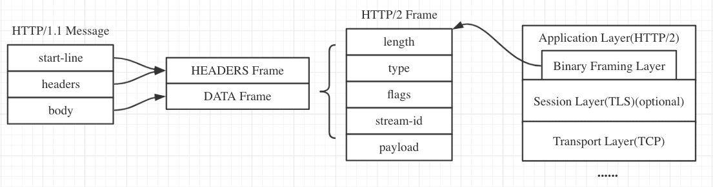

#### 1、HTTP 缓存

<details>
<summary>查看解析</summary>

HTTP 缓存又分为强缓存和协商缓存

- 首先通过 `Cache-Control` 验证强缓存是否可用，如果强缓存可用，那么直接读取缓存
- 如果不可以，那么进入协商缓存阶段，发起 HTTP 请求，服务器通过请求头中是否带上 `If-Modified-Since` 和 `If-None-Match` 这些条件请求字段检查资源是否更新：

若资源更新，那么返回资源和 200 状态码
如果资源未更新，返回 304 告诉浏览器直接使用缓存获取资源

> Cache-Control 常见取值
> （1） max-age：用来设置资源可以被缓存多长时间，单位为秒；
> （2） s-maxage：和 max-age 是一样的，不过它只针对代理服务器缓存而言；
> （3）public：指示响应可被任何缓存区缓存；
> （4）private：只能针对个人用户，而不能被代理服务器缓存；
> （5）no-cache：强制协商缓存。
> （6）no-store：禁止一切缓存（这个才是响应不被缓存的意思）。

</details>

#### 2、HTTP 常用的状态码及使用场景？

<details>
<summary>查看解析</summary>

1xx：表示目前是协议的中间状态，还需要后续请求
2xx：表示请求成功
3xx：表示重定向状态，需要重新请求
4xx：表示请求报文错误
5xx：服务器端错误

常用状态码：

101 切换请求协议，从 HTTP 切换到 WebSocket
200 请求成功，有响应体
301 永久重定向：会缓存
302 临时重定向：不会缓存
304 协商缓存命中
403 服务器禁止访问
404 资源未找到
400 请求错误
500 服务器端错误
503 服务器繁忙

场景：

`302`: 一般是访问某个网站的资源需要权限时，会需要用户去登录，跳转到登录页面之后登录之后，还可以继续访问。
`301`: 类似，都会跳转到一个新的网站，但是 301 代表访问的地址的资源被永久移除了，以后都不应该访问这个地址，搜索引擎抓取的时候也会用新的地址替换这个老的。可以在返回的响应的 `location` 首部去获取到返回的地址。

</details>

#### 3、HTTP 常用的请求方式，区别和用途？

<details>
<summary>查看解析</summary>

http/1.1 规定如下请求方法：

GET：通用获取数据
HEAD：获取资源的元信息，类似于 get 请求，只不过返回的响应中没有具体的内容，用于获取报头
POST：提交数据
PUT：修改数据
DELETE：删除数据
CONNECT：建立连接隧道，用于代理服务器
OPTIONS：列出可对资源实行的请求方法，常用于跨域（比如针对跨域资源的预检）
TRACE：追踪请求-响应的传输路径

</details>

#### 4、HTTPS 是什么？具体流程？优缺点？

<details>
<summary>查看解析</summary>

HTTPS = HTTP + SSL / TLS

HTTPS 是在 HTTP 和 TCP 之间建立了一个安全层，HTTP 与 TCP 通信的时候，必须先进过一个安全层，对数据包进行加密，然后将加密后的数据包传送给 TCP，相应的 TCP 必须将数据包解密，才能传给上面的 HTTP。

优点：安全
缺点：钱、服务端资源、相应速度


</details>

#### 5、三次握手和四次挥手

<details>
<summary>查看解析</summary>

略

</details>

#### 6、在交互过程中如果数据传送完了，还不想断开连接怎么办，怎么维持？

<details>
<summary>查看解析</summary>

在 HTTP 中响应体的 `Connection` 字段指定为 `keep-alive`

</details>

#### 7、你对 TCP 滑动窗口有了解嘛？

<details>
<summary>查看解析</summary>

在 TCP 链接中，对于发送端和接收端而言，TCP 需要把发送的数据放到发送缓存区, 将接收的数据放到接收缓存区。而经常会存在发送端发送过多，而接收端无法消化的情况，所以就需要`流量控制`，就是在通过接收缓存区的大小，控制发送端的发送。如果对方的接收缓存区满了，就不能再继续发送了。而这种流量控制的过程就需要在发送端维护一个发送窗口，在接收端维持一个接收窗口。

TCP 滑动窗口分为两种: 发送窗口和接收窗口。

</details>

#### 8、TCP 协议怎么保证可靠的，UDP 为什么不可靠？

<details>
<summary>查看解析</summary>

TCP 是面向连接的、可靠的、传输层通信协议
UDP 是无连接的传输层通信协议，继承 IP 特性,基于数据报

为什么 TCP 可靠？TCP 的可靠性体现在有状态和控制

- 会精准记录那些数据发送了，那些数据被对方接收了，那些没有被接收，而且保证数据包按序到达，不允许半点差错，这就是有状态
- 当意识到丢包了或者网络环境不佳，TCP 会根据具体情况调整自己的行为，控制自己的发送速度或者重发，这是可控制的

反之 UDP 就是无状态的和不可控制的

</details>

#### 9、HTTP 的特点

<details>
<summary>查看解析</summary>

- 灵活可扩展，除了规定空格分隔单词，换行分隔字段以外，其他都没有限制，不仅仅可以传输文本，还可以传输图片、视频等任意资源
- 可靠传输，基于 TCP/IP 所以继承了这一特性
  请求-应答，有来有回
- 无状态，每次 HTTP 请求都是独立的，无关的、默认不需要保存上下文信息

缺点：

- 明文传输不安全
- TCP 连接数限制，对于同一个域名，浏览器最多只能同时创建 6~8 个 TCP 连接 (不同浏览器不一样)
- 队头拥塞，每个 TCP 连接同时只能处理一个请求 - 响应，浏览器按 FIFO 原则处理请求，如果上一个响应没返回，后续请求 - 响应都会受阻。
- Header 内容多，而且每次请求 Header 不会变化太多，没有相应的压缩传输优化方案

</details>

#### 10、HTTP 2 改进

<details>
<summary>查看解析</summary>

- 二进制分帧层
  帧是数据传输的最小单位，以二进制传输代替原本的明文传输，原本的报文消息被划分为更小的数据帧:

  

- 多路复用
  在一个 TCP 连接上，我们可以向对方不断发送帧，每帧的 stream identifier 的标明这一帧属于哪个流，然后在对方接收时，根据 stream identifier 拼接每个流的所有帧组成一整块数据。
  把 HTTP/1.1 每个请求都当作一个流，那么多个请求变成多个流，请求响应数据分成多个帧，不同流中的帧交错地发送给对方，这就是 HTTP/2 中的多路复用。
  流的概念实现了单连接上多请求 - 响应并行，解决了线头阻塞的问题，减少了 TCP 连接数量和 TCP 连接慢启动造成的问题
  所以 http2 对于同一域名只需要创建一个连接，而不是像 http/1.1 那样创建 6~8 个连接:

- 服务端推送 (Server Push)
  浏览器发送一个请求，服务器主动向浏览器推送与这个请求相关的资源，这样浏览器就不用发起后续请求。

- Header 压缩 (HPACK)
  使用 [HPACK](https://httpwg.org/specs/rfc7541.html) 算法来压缩首部内容

</details>

#### 11、post 和 get 的区别

<details>
<summary>查看解析</summary>

- 从`参数`的角度，GET 一般放在 URL 中，因此**不安全**，POST 放在请求体中，更适合传输敏感信息。GET 提交的**数据长度**是有限制的，因为 URL 长度有限制，具体的长度限制视浏览器而定。而 POST 没有
- 从`幂等性`的角度，GET 是幂等的，而 POST 不是。(幂等表示执行相同的操作，结果也是相同的)
- 从`使用场景`的角度 get 多用来查询，不会对服务器上的内容产生作用。post 用来提交.
- 从`缓存`的角度，GET 请求会被浏览器主动缓存下来，留下历史记录，而 POST 默认不会。

</details>

#### 12、对 Accept 系列字段了解多少？

<details>
<summary>查看解析</summary>

- 数据格式
  HTTP 从 MIME(Multipurpose Internet Mail Extensions, 多用途互联网邮件扩展) type 取了一部分来标记报文 body 部分的数据类型，这些类型体现在 `Content-Type` 这个字段，当然这是针对于发送端而言，接收端想要收到特定类型的数据，也可以用 `Accept` 字段
  > 具体而言，这两个字段的取值可以分为下面几类:
  > text： text/html, text/plain, text/css 等
  > image: image/gif, image/jpeg, image/png 等
  > audio/video: audio/mpeg, video/mp4 等
  > application: application/json, application/javascript, application/pdf, application/octet-stream
- 压缩方式

  ```js
  // 发送端
  Content-Encoding: gzip
  // 接收端
  Accept-Encoding: gzip
  ```

- 支持语言
  对于发送方而言，还有一个 `Content-Language` 字段，在需要实现国际化的方案当中，可以用来指定支持的语言，在接受方对应的字段为 `Accept-Language`
- 字符集
  最后是一个比较特殊的字段, 在接收端对应为 Accept-Charset，指定可以接受的字符集，而在发送端并没有对应的 Content-Charset, 而是直接放在了 Content-Type 中，以 charset 属性指定。如:

  ```js
  // 发送端
  Content-Type: text/html; charset=utf-8
  // 接收端
  Accept-Charset: charset=utf-8
  ```

</details>

#### 13、HTTP 如何处理大文件的传输？

<details>
<summary>查看解析</summary>

对于几百 M 甚至上 G 的大文件来说，如果要一口气全部传输过来显然是不现实的，会有大量的等待时间，严重影响用户体验。因此，HTTP 针对这一场景，采取了`范围请求`的解决方案，允许客户端仅仅请求一个资源的一部分。

当然，前提是服务器要支持范围请求，要支持这个功能，就必须加上这样一个响应头:

```
Accept-Ranges: none
```

用来告知客户端这边是支持范围请求的。

而对于客户端而言，它需要指定请求哪一部分，通过 `Range` 这个请求头字段确定，格式为 `bytes=x-y`

服务器收到请求之后，首先验证范围是否合法，如果越界了那么返回 416 错误码，否则读取相应片段，返回 206 状态码。

同时，服务器需要添加 `Content-Range` 字段，这个字段的格式根据请求头中 Range 字段的不同而有所差异。

```js
// 请求
// 单段数据
Range: bytes=0-9
// 多段数据
Range: bytes=0-9, 30-39

// 响应
HTTP/1.1 206 Partial Content
Content-Length: 10
Accept-Ranges: bytes
Content-Range: bytes 0-9/100

i am xxxxx
```

</details>

#### 14、HTTP 中如何处理表单数据的提交？

<details>
<summary>查看解析</summary>

在 http 中，有两种主要的表单提交的方式，体现在两种不同的`Content-Type` 取值:

- application/x-www-form-urlencoded
  其中的数据会被编码成以&分隔的键值对
  字符以 URL 编码方式编码。
- multipart/form-data
  在实际的场景中，常用于图片等文件的上传，因为没有必要做 URL 编码，带来巨大耗时的同时也占用了更多的空间

</details>

#### 15、对 Cookie 了解多少？

<details>
<summary>查看解析</summary>

**Cookie 简介**
HTTP 是一个无状态的协议，每次 http 请求都是独立、无关的，默认不需要保留状态信息。但有时候需要保存一些状态，怎么办呢？
HTTP 为此引入了 Cookie。Cookie 本质上就是浏览器里面存储的一个很小的文本文件，内部以键值对的方式来存储(在 chrome 开发者面板的 Application 这一栏可以看到)。向同一个域名下发送请求，都会携带相同的 Cookie，服务器拿到 Cookie 进行解析，便能拿到客户端的状态。而服务端可以通过响应头中的 `Set-Cookie` 字段来对客户端写入 Cookie。举例如下:

```javascript
// 请求头
Cookie: a=xxx;b=xxx
// 响应头
Set-Cookie: a=xxx
set-Cookie: b=xxx
```

**Cookie 属性**

- Expires 即过期时间
- Max-Age 用的是一段时间间隔，单位是秒，从浏览器收到报文开始计算。
- Domain 和 path 确定作用域
- 如果带上 Secure，说明只能通过 HTTPS 传输 cookie
- HttpOnly，那么说明只能通过 HTTP 协议传输，不能通过 JS 访问，这也是预防 XSS 攻击的重要手段
- 对于 CSRF 攻击的预防，也有 SameSite 属性
  SameSite 可以设置为三个值，Strict、Lax 和 None。
  a. 在 Strict 模式下，浏览器完全禁止第三方请求携带 Cookie。比如请求 a.com 网站只能在 a.com 域名当中请求才能携带 Cookie，在其他网站请求都不能。
  b. 在 Lax 模式，就宽松一点了，但是只能在 get 方法提交表单况或者 a 标签发送 get 请求的情况下可以携带 Cookie，其他情况均不能。
  c. 在 None 模式下，也就是默认模式，请求会自动携带上 Cookie。

**Cookie 的缺点**

- 容量缺陷。Cookie 的体积上限只有 4KB，只能用来存储少量的信息。
- 性能缺陷。Cookie 紧跟域名，不管域名下面的某一个地址需不需要这个 Cookie ，请求都会携带上完整的 Cookie，这样随着请求数的增多，其实会造成巨大的性能浪费的，因为请求携带了很多不必要的内容。但可以通过 Domain 和 Path 指定作用域来解决。
- 安全缺陷。由于 Cookie 以纯文本的形式在浏览器和服务器中传递，很容易被非法用户截获，然后进行一系列的篡改，在 Cookie 的有效期内重新发送给服务器，这是相当危险的。另外，在 HttpOnly 为 false 的情况下，Cookie 信息能直接通过 JS 脚本来读取。

</details>

#### 16、如何理解 HTTP 代理？

<details>
<summary>查看解析</summary>

我们知道在 HTTP 是基于请求-响应模型的协议，一般由客户端发请求，服务器来进行响应。
当然，也有特殊情况，就是代理服务器的情况。引入代理之后，作为代理的服务器相当于一个中间人的角色，对于客户端而言，表现为服务器进行响应；而对于源服务器，表现为客户端发起请求，具有双重身份。
那代理服务器到底是用来做什么的呢？

- **负载均衡**。客户端的请求只会先到达代理服务器，后面到底有多少源服务器，IP 都是多少，客户端是不知道的。因此，这个代理服务器可以拿到这个请求之后，可以通过特定的算法分发给不同的源服务器，让各台源服务器的负载尽量平均。当然，这样的算法有很多，包括随机算法、轮询、一致性 hash、LRU(最近最少使用)等等，不过这些算法并不是本文的重点，大家有兴趣自己可以研究一下。

- **保障安全**。利用心跳机制监控后台的服务器，一旦发现故障机就将其踢出集群。并且对于上下行的数据进行过滤，对非法 IP 限流，这些都是代理服务器的工作。

- **缓存代理**。将内容缓存到代理服务器，使得客户端可以直接从代理服务器获得而不用到源服务器那里。

</details>

#### 17、什么是跨域？浏览器如何拦截响应？如何解决？

<details>
<summary>查看解析</summary>

浏览器遵循同源政策(`scheme(协议)`、`host(主机)` 和 `port(端口)` 都相同则为同源)。非同源站点有这样一些限制:

- 不能读取和修改对方的 DOM
- 不读访问对方的 Cookie、IndexDB 和 LocalStorage
- 限制 XMLHttpRequest 请求。(后面的话题着重围绕这个)

当浏览器向目标 URI 发 Ajax 请求时，只要当前 URL 和目标 URL 不同源，则产生跨域，被称为跨域请求。
跨域请求的响应一般会被浏览器所拦截，注意，是被浏览器拦截，响应其实是成功到达客户端了。那这个拦截是如何发生呢？

在服务端处理完数据后，将响应返回，主进程检查到跨域，且没有 cors(后面会详细说)响应头，将响应体全部丢掉，并不会发送给渲染进程。这就达到了拦截数据的目的。

接下来我们来说一说解决跨域问题的几种方案。

**CORS**

CORS 其实是 W3C 的一个标准，全称是`跨域资源共享`。它需要浏览器和服务器的共同支持。

1、简单请求

- 请求方法为 `GET`、`POST` 或者 `HEAD`
- 请求头的取值范围: Accept、Accept-Language、Content-Language、Content-Type(只限于三个值 application/x-www-form-urlencoded、multipart/form-data、text/plain)

请求发出去之前，浏览器会自动在请求头当中，添加一个 `Origin` 字段，用来说明请求来自哪个源。服务器拿到请求之后，在回应时对应地添加 `Access-Control-Allow-Origin` 字段，如果 Origin 不在这个字段的范围中，那么浏览器就会将响应拦截。

与此同时，还有其它一些可选的功能性的字段：

- `Access-Control-Allow-Credentials`
- `Access-Control-Expose-Headers`: 给 XMLHttpRequest 对象赋能，让它不仅可以拿到基本的 6 个响应头字段（包括 Cache-Control、Content-Language、Content-Type、Expires、Last-Modified 和 Pragma）, 还能拿到这个字段声明的响应头字段

2、非简单请求

预检请求和响应字段

我们以 PUT 方法为例。

```js
var url = "http://xxx.com";
var xhr = new XMLHttpRequest();
xhr.open("PUT", url, true);
xhr.setRequestHeader("X-Custom-Header", "xxx");
xhr.send();
```

当这段代码执行后，首先会发送预检请求。这个预检请求的请求行和请求体是下面这个格式:

```
OPTIONS / HTTP/1.1
Origin: 当前地址
Host: xxx.com
Access-Control-Request-Method: PUT
Access-Control-Request-Headers: X-Custom-Header
```

预检请求的方法是 `OPTIONS`，同时会加上 `Origin` 源地址和 `Host`目标地址，这很简单。同时也会加上两个关键的字段:

`Access-Control-Request-Method`, 列出 CORS 请求用到哪个 HTTP 方法
`Access-Control-Request-Headers`，指定 CORS 请求将要加上什么请求头

这是预检请求。接下来是响应字段，响应字段也分为两部分，一部分是对于预检请求的响应，一部分是对于 CORS 请求的响应。
预检请求的响应。如下面的格式:

```
HTTP/1.1 200 OK
Access-Control-Allow-Origin: *
Access-Control-Allow-Methods: GET, POST, PUT
Access-Control-Allow-Headers: X-Custom-Header
Access-Control-Allow-Credentials: true
Access-Control-Max-Age: 1728000
Content-Type: text/html; charset=utf-8
Content-Encoding: gzip
Content-Length: 0
```

其中有这样几个关键的响应头字段:

- `Access-Control-Allow-Origin`: 表示可以允许请求的源，可以填具体的源名，也可以填\*表示允许任意源请求。
- `Access-Control-Allow-Methods`: 表示允许的请求方法列表。
- `Access-Control-Allow-Credentials`: 简单请求中已经介绍。
- `Access-Control-Allow-Headers`: 表示允许发送的请求头字段
- `Access-Control-Max-Age`: 预检请求的有效期，在此期间，不用发出另外一条预检请求。

在预检请求的响应返回后，如果请求不满足响应头的条件，则触发 XMLHttpRequest 的 onerror 方法，当然后面真正的 CORS 请求也不会发出去了。

如果满足就和简单请求一样了

**JSONP**

和 CORS 相比，JSONP 最大的优势在于兼容性好，IE 低版本不能使用 CORS 但可以使用 JSONP，缺点也很明显，请求方法单一，**只支持 GET 请求**。

**Nginx**

`Nginx` 是一种高性能的反向代理服务器，可以用来轻松解决跨域问题。

正向代理帮助客户端访问客户端自己访问不到的服务器，然后将结果返回给客户端。

反向代理拿到客户端的请求，将请求转发给其他的服务器，主要的场景是维持服务器集群的负载均衡，换句话说，反向代理帮其它的服务器拿到请求，然后选择一个合适的服务器，将请求转交给它。

</details>
