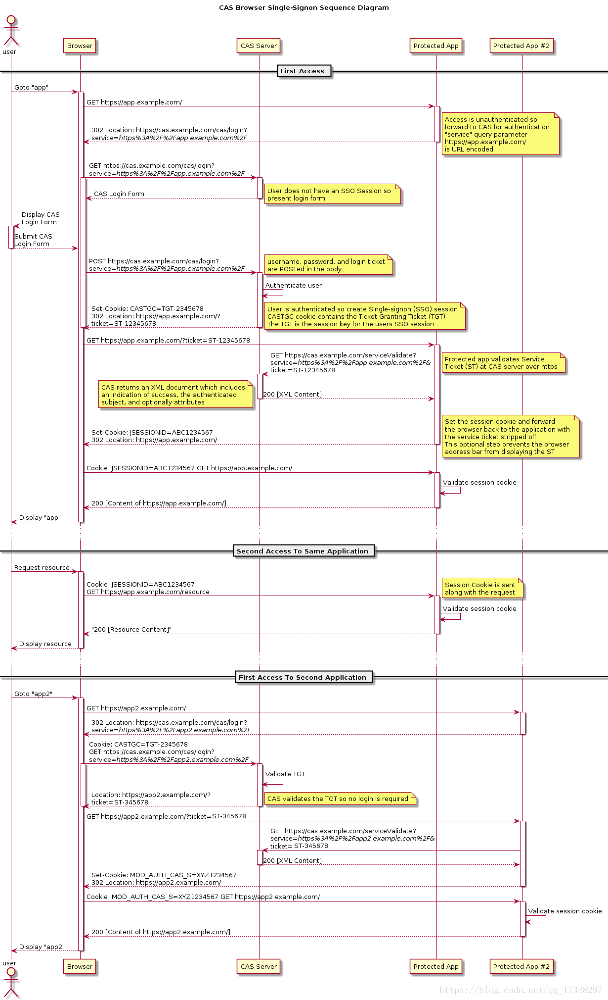

#### 1、常见的前后端鉴权方式

<details>
<summary>查看解析</summary>

##### Session-Cookie

session 是另一种记录服务器和客户端会话状态的机制
session 是基于 cookie 实现的，session 存储在服务器端，sessionId 会被存储到客户端的 cookie 中
SessionID 是连接 Cookie 和 Session 的一道桥梁

使用 Session 保持会话信息使用起来非常简单，技术也非常成熟。但是也存在下面的几个问题：

- 服务器压力大：通常 Session 是存储在内存中的，每个用户通过认证之后都会将 session 数据保存在服务器的内存中，而当用户量增大时，服务器的压力增大。
- Session 共享：现在很多应用都是分布式集群，需要我们做额外的操作进行 Session 共享；
- CSRF 跨站伪造请求攻击：Session 机制是基于浏览器端的 cookie 的，cookie 如果被截获，用户就会很容易受到跨站请求伪造的攻击。

##### Token 验证（包括 JWT，SSO）

什么是 Token（令牌）？

- `Access Token`: 访问资源接口（API）时所需要的资源凭证
- `Refresh Token`: refresh token 是专用于刷新 access token 的 token。

Access Token 的时效一般比较短，防止泄露，例如设置 Access Token 一周，Refresh Token 一个月

> refresh_token 意义在哪里？更安全吗？
> refresh_token 只能与授权服务器交换，而只能 access_token 与资源服务器交换。这样可以减轻“ access-token 长期泄漏”的风险

基于 token 的验证机制，有以下的优点：

- 支持跨域访问，将 token 置于请求头中，而 cookie 是不支持跨域访问的；
- 无状态化，服务端无需存储 token，只需要验证 token 信息是否正确即可，而 session 需要在服务端存储，一般是通过 cookie 中的 sessionID 在服务端查找对应的 session；
- 更适用于移动端（Android，iOS，小程序等等），像这种原生平台不支持 cookie，比如说微信小程序，每一次请求都是一次会话，当然我们可以每次去手动为他添加 cookie

不过也有缺点：
由于服务器不保存 token，因此无法在使用过程中废止某个 token，或者更改 token 的权限。也就是说，**一旦 token 签发了，在到期之前就会始终有效**，除非服务器部署额外的逻辑。
所以一般时效比较短。

**JWT（JSON Web Token）就是基于 token 认证的代表**

由三部分组成，并用 `.` 连接，`Header.Payload.Signature`

Header 和 Payload 是不加密的，只是使用 `Base64URL` 算法转成字符串，所以不要放重要数据

Signature 部分是对前两部分的签名，防止数据篡改，密钥只有服务器才知道

```
HMACSHA256(
base64UrlEncode(header) + "." +
base64UrlEncode(payload),
secret)
```

一般 JWT 放在 HTTP 请求的头信息 `Authorization` 字段里面

```
Authorization: Bearer <token>
```

对比 Simple Web Tokens (SWT) and Security Assertion Markup Language Tokens (SAML) 的优势在：

- JSON 不如 XML 冗长，因此在编码时 JSON 的大小也较小，从而使 JWT 比 SAML 更为紧凑。这使得 JWT 是在 HTML 和 HTTP 环境中传递的不错的选择
- JSON 解析器在大多数编程语言中都很常见，这使使用 JWT 更加容易
- 安全性

##### OAuth2.0（开放授权）

允许用户让第三方应用访问该用户在某一网站上存储的私密的资源（如照片，视频，联系人列表），而无需将用户名和密码提供给第三方应用

github 的例子

- 在 github 注册一个第三方应用，填写回调地址
- 在第三方应用点击 github 登录，跳转 GitHub 授权中心（附带第三方应用 id），用户输入 github 账号密码，通过则返回一个 access token，重定向到第三方应用
- 获取 GitHub 数据资源

微信授权类似

#### SSO 认证

登录认证和业务系统分离，使用独立的登录中心，实现了在登录中心登录后，所有相关的业务系统都能免登录访问资源

OAuth2.0 和 SSO 在业务系统中都没有账号和密码，账号密码是存放在登录中心或授权服务器中的，这就是所谓的使用令牌代替账号密码访问应用。

SSO 的实现有很多框架，比如 CAS 框架，以下是 CAS 框架的官方流程图



重点看下访问第二个业务系统是如何**免登陆**的？

和登录中心的会话在第一次访问的时候就建立了，存在 Cookie，访问第二个业务系统时，302 Location 重定向到登录中心，访问时会自动带上 Cookie，认证通过直接重定向到业务系统并带上 ticket。

[对 SSO 单点登录和 OAuth2.0 的区别和理解](https://zebinh.github.io/2020/03/SSOANDOAuth/)

</details>

#### 2、性能优化

<details>
<summary>
使用 Gzip 压缩；
利用缓存 Cache-Control 响应头；
懒加载；
预加载和预获取；
其它：IconFont、减少 Cookie 大小、第三方服务器跨域请求资源 dns-prefetch；

</summary>

##### 使用 Gzip 压缩

请求头 accept-encoding: gzip, deflate, br
响应头 Content-Encoding: gzip
方式 CompressionWebpackPlugin + Nginx gzip on

##### 利用缓存 Cache-Control 响应头

图片 Cache-Control: max-age=2592000 （一个月）
css Cache-Control: max-age=3600（一小时）
js Cache-Control: max-age=3600（一小时）
cdn js Cache-Control: public, max-age=31536000（一年）
一般是在 Nginx 正则匹配资源添加不同的响应头部和缓存策略

##### 懒加载

- 资源文件拆分，按需加载
- 图片按需加载

##### Preload key requests

> Consider using `<link rel=preload>` to prioritize fetching resources that are currently requested later in page load

`preload` 的设计初衷是为了尽早加载首屏需要的关键资源，从而提升页面渲染性能.

- prefetch(预获取)：将来某些导航下可能需要的资源
- preload(预加载)：当前导航下可能需要资源

最佳实践：

- **大部分场景下无需特意使用 preload**，目前浏览器基本上都具备预测解析能力，可以提前解析入口 html 中外链的资源，因此入口脚本文件、样式文件等不需要特意进行 preload。
- 类似**字体文件**这种隐藏在脚本、样式中的首屏关键资源，建议使用 `preload`
- **异步加载的模块**（典型的如单页系统中的非首页）建议使用 `prefetch`
- **大概率即将被访问到的资源**可以使用 `prefetch` 提升性能和体验

具体实践：

- preload-webpack-plugin
- webpack 预获取/预加载模块
  下面这个 prefetch 的简单示例中，有一个 HomePage 组件，其内部渲染一个 LoginButton 组件，然后在点击后按需加载 LoginModal 组件

  ```js
  import(/* webpackPrefetch: true */ "./path/to/LoginModal.js");
  ```

  > LoginModal 是一个大概率被访问到的资源，可以预先获取

  我们假想这里的图表组件 ChartComponent 组件需要依赖体积巨大的 ChartingLibrary 库。它会在渲染时显示一个 LoadingIndicator(加载进度条) 组件，然后立即按需导入 ChartingLibrary：

  ```js
  // ChartComponent.js
  import(/* webpackPreload: true */ "ChartingLibrary");
  ```

**注意：**

- 当无法缓存的时候，prefetch 预提取的资源不会被缓存，第二次加载仍然是从服务器加载，因此，如果要使用 prefetch，相应的资源必须做好合理的缓存控制。
- preload 的字体资源必须设置 `crossorigin` 属性，否则会导致重复加载。
- 两者的兼容性目前都还不是太好。好在不支持 preload 和 prefetch 的浏览器会自动忽略它，因此可以将它们作为一种渐进增强功能

**与 async/defer 的对比：**

使用 async/defer 属性在加载脚本的时候不阻塞 HTML 的解析，defer 加载脚本执行会在所有元素解析完成，DOMContentLoaded 事件触发之前完成执行。它的用途其实跟 preload 十分相似。你可以使用 defer 加载脚本在 head 末尾，这比将脚本放在 body 底部效果来的更好。

1、它相比于 preload 加载的优势在于浏览器**兼容性**好，从 caniuse 上看基本上所有浏览器都支持，覆盖率达到 93%，
2、不足之处在于：**defer 只作用于脚本文件，对于样式、图片等资源就无能为力了，并且 defer 加载的资源是要执行的，而 preload 只下载资源并不执行，待真正使用到才会执行文件**。
3、对于页面上主/首屏脚本，可以直接使用 defer 加载，而对于非首屏脚本/其它资源，可以采用 preload/prefeth 来进行加载。

##### IconFont

##### 减少 Cookie 大小

- 减少无用 cookie
- 控制好 domain, 不要污染子域

##### 第三方服务器跨域请求资源

尽管 `dns-prefetch` 仅执行 DNS 查找，但 `preconnect` 会建立与服务器的连接。如果站点是通过 HTTPS 服务的，则此过程包括 DNS 解析，建立 TCP 连接以及执行 TLS 握手。将两者结合起来可提供进一步减少跨域请求的感知延迟的机会

```
<link rel="preconnect" href="https://fonts.gstatic.com/" crossorigin>
<link rel="dns-prefetch" href="https://fonts.gstatic.com/">
```

> Note: 如果页面需要建立与许多第三方域的连接，则将它们预先连接会适得其反。 preconnect 提示最好仅用于最关键的连接。对于其他的，只需使用 <link rel="dns-prefetch"> 即可节省第一步的时间-DNS 查找。

</details>
